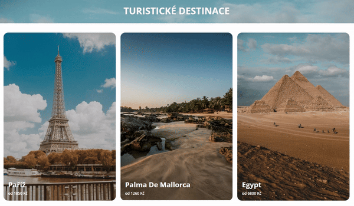

# [CSSTuristickeDestinace - Turistické cíle (transform, transition)](https://pslib-cz.github.io/2023-p2a-web-tur-cile-steveruu/)

## Zadání

Nakódujte web dle předlohy v podobě screenshotů. Obrázky a video turistických destinací použité
v předloze máte k dispozici.

- Vhodně kombinujte CSS vlastnost filter a pseudotřídy :hover, :not() a :has()
- **Každý z itemů je proklikávatelný** – hypoteticky odkazuje na detail destinace.
- **Použité písmo** – Open Sans v řezu normal a bold
- **Šířka sloupce (obrázku) je 300 – 600px** (na mobilním zobrazení 100 %)

**Pozadí hlavičky webu** je tvořeno horní části obrázku _egypt.jpg_ , viz náznak „vykukujících“ pyramid.

_Obrázek 1 – desktop 1920w pohled_

_Obrázek 2 – mobile 320w pohled_

Není potřeba používat MediaQuery – vystačíte s fit-content v grid-template-columns...

různé velikosti okna

## úzký pohled střední pohled široký pohled

+ při najetí myši na konkrétní (viz přiložené video)

